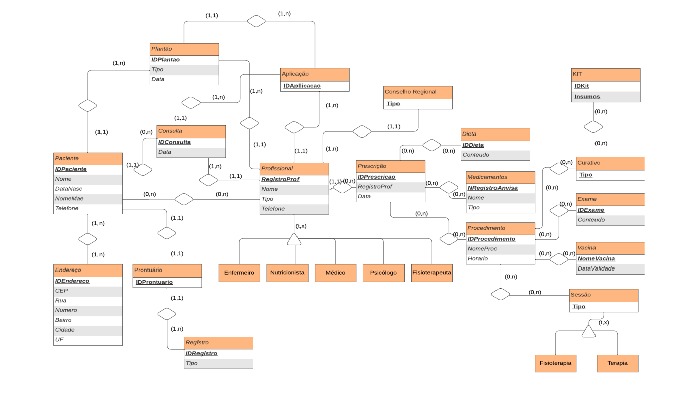

# Projeto: Home Care

Este repositório contém o projeto de banco de dados para o sistema **Home Care**, desenvolvido com base em um modelo conceitual, lógico e físico. O objetivo é organizar e gerenciar dados relacionados a atendimentos domiciliares, como plantões, consultas, prescrições e procedimentos realizados por profissionais da saúde.

---

## Ferramentas Utilizadas

- **Diagrama ER**: Criado utilizando [Lucidchart](https://www.lucidchart.com/).
- **Editor de Código-Fonte**: [Visual Studio Code (VSCode)](https://code.visualstudio.com/).
- **Banco de Dados**: [PostgreSQL](https://www.postgresql.org/).
- **Ferramenta de Administração de Banco de Dados**: [DBeaver](https://dbeaver.io/).
- **Contêiner**: Configuração do banco através de um arquivo `docker-compose.yml` para criação e execução de um container PostgreSQL usando [Docker](https://www.docker.com/).

---

## Estrutura do Projeto

### Pastas

- **db-startup-scripts/**: Contém os scripts SQL para:
  - Criação de tabelas.
  - Inserts iniciais para popular o banco.
  - Definição de procedures, triggers, views e índices.

- **diagrams/**: Contém o diagrama ER do projeto em formato png: 



---

## Modelo Lógico

O modelo lógico foi desenvolvido com base no modelo conceitual, apresentando as seguintes entidades e relações:

### Entidades e Relacionamentos:

#### Plantão
```plaintext
Plantao(IDPlantao, Tipo, Data, IDPaciente, NumRegistroProf)
    IDPaciente referencia Paciente
    NumRegistroProf referencia Profissional
```

#### Aplicação
```plaintext
Aplicacao(IDAplicacao, NumRegistroProf, IDPlantao, IDConsulta)
    NumRegistroProf referencia Profissional
    IDPlantao referencia Plantao
    IDConsulta referencia Consulta
```

#### Consulta
```plaintext
Consulta(IDConsulta, IDPaciente, NumRegistroProf, Data)
    NumRegistroProf referencia Profissional
    IDPaciente referencia Paciente
```

#### Paciente
```plaintext
Paciente(IDPaciente, IDProntuario, Nome, DataNasc, NomeMae, Tel)
    IDProntuario referencia Prontuario
```

#### Paciente Profissional
```plaintext
Paciente_Profissional(IDPaciente, NumRegistroProf)
    IDPaciente referencia Paciente
    NumRegistroProf referencia Profissional
```

#### Endereço
```plaintext
Endereco(IDEndereco, CEP, Rua, Numero, Bairro, Cidade, UF)
```

#### Endereço do Paciente
```plaintext
Paciente_Endereco(IDPaciente, IDEndereco)
    IDEndereco referencia Endereco
```

#### Prontuário
```plaintext
Prontuario(IDProntuario)
```

#### Prontuário Profissional
```plaintext
Prontuario_Profissional(IDProntuario, NumRegistroProf)
    NumRegistroProf referencia Profissional
```

#### Registro
```plaintext
Registro(IDRegistro, IDProntuario, Tipo)
    IDProntuario referencia Prontuario
```

#### Profissional
```plaintext
Profissional(NumRegistroProf, Tipo, Nome, Tel)
```

#### Conselho
```plaintext
Conselho(Tipo)
```

#### Prescrição
```plaintext
Prescricao(IDPrescricao, Data, NumRegistroProf, IDPaciente)
    IDPaciente referencia Paciente
    NumRegistroProf referencia Profissional
```

#### Prescrição Profissional
```plaintext
Profissional_Prescricao(NumRegistroProf, IDPrescricao)
    NumRegistroProf referencia Profissional
    IDPrescricao referencia Prescricao
```

#### Dieta
```plaintext
Dieta(IDDieta, Conteudo)
```

#### Prescrição de Dieta
```plaintext
Prescricao_Dieta(IDPrescricao, IDDieta)
    IDDieta referencia Dieta
```

#### Prescrição de Medicamento
```plaintext
Prescricao_Medicamentos(IDPrescricao, NRegistroAnvisa)
    IDPrescricao referencia Prescricao
    NRegistroAnvisa referencia Medicamento
```

#### Prescrição do Procedimento
```plaintext
Prescricao_Procedimento(IDPrescricao, IDProcedimento)
    IDPrescricao referencia Prescricao
    IDProcedimento referencia Procedimento
```

#### Medicamentos
```plaintext
Medicamentos(NRegistroAnvisa, Nome, Tipo)
```

#### Exame
```plaintext
Exame(IDExame, Conteudo)
```

#### Procedimentos
```plaintext
Procedimentos(IDProcedimento, NomeProced, Horario)
```

#### Vacina
```plaintext
Vacina(NomeVacina, DataValidade)
```

#### Curativo
```plaintext
Curativo(Tipo)
```

#### Sessão
```plaintext
Sessao(Tipo)
```

#### Procedimento de Vacinação
```plaintext
Procedimento_Vacina(IDProcedimento, NomeVacina)
    IDProcedimento referencia Procedimento
    NomeVacina referencia Vacina
```

#### Procedimento do Exame
```plaintext
Procedimento_Exame(IDProcedimento, IDExame)
    IDProcedimento referencia Procedimento
    IDExame referencia Exame
```

#### Procedimento de Curativo
```plaintext
Procedimento_Curativo(IDProcedimento, TipoCurativo)
    IDProcedimento referencia Procedimento
    TipoCurativo referencia Curativo
```

#### Procedimento Sessão
```plaintext
Procedimento_Sessao(IDProcedimento, TipoSessao)
    IDProcedimento referencia Procedimento
    TipoSessao referencia Sessao
```

#### Kit de Insumos
```plaintext
Kit(IDKit, Insumos)
```

#### Kit de Curativos
```plaintext
Curativo_Kit(TipoCurativo, IDKit)
    TipoCurativo referencia Curativo
    IDKit referencia Kit
```

---

## Configuração do Ambiente

1. **Criação do Container PostgreSQL**:
   - Um arquivo `docker-compose.yml` foi configurado para criar e executar um contêiner PostgreSQL.

2. **Scripts de Inicialização**:
   - Localizados na pasta `db-startup-scripts/`, incluem:
     - Scripts para criação de tabelas.
     - Inserts iniciais para popular o banco.
     - Definição de procedures, triggers, views e índices.

---

## Informações do Desenvolvedor

- **Nome**: Camila Vieira Ferrari Correia
- **LinkedIn**: https://www.linkedin.com/in/camila-ferrari/

---
## Observações

- O **Diagrama ER** do modelo conceitual será anexado na pasta `diagrams/`.
- O repositório local foi configurado para facilitar o versionamento e colaboração no desenvolvimento do banco de dados.
